# A-IR-DD2 — Features

> Complete feature reference. For the quick overview → [README.md](README.md)

---

## Table of contents

1. [Guest mode vs authenticated mode](#1-guest-mode-vs-authenticated-mode)
2. [LLM configuration — cloud & local](#2-llm-configuration--cloud--local)
3. [Archi — AI agent prototyping](#3-archi--ai-agent-prototyping)
4. [Bos — supervision & workflow management](#4-bos--supervision--workflow-management)
5. [Com — API & database connectors](#5-com--api--database-connectors)
6. [Phil — custom function IDE](#6-phil--custom-function-ide)
7. [Workflow canvas — the main stage](#7-workflow-canvas--the-main-stage)
8. [Security model](#8-security-model)

---

## 1. Guest mode vs authenticated mode

A-IR-DD2 can be used without an account in **guest mode** — ideal for quick exploration. Creating an account unlocks full persistence and multi-workflow management.

| Feature | Guest | Authenticated |
|---------|-------|---------------|
| Chat with agents | ✅ | ✅ |
| LLM configuration | Browser localStorage | MongoDB (AES-256-GCM encrypted) |
| Workflow persistence | ❌ | ✅ |
| Multiple workflows | ❌ | ✅ |
| Conversation history | Session only | Persistent |
| Media storage | ❌ | MongoDB-backed journals / Workspace / S3-GCS |
| Multi-device sync | ❌ | ✅ |

---

## 2. LLM configuration — cloud & local

The **LLM settings panel** is the entry point of the application. Each user configures their own providers — API keys are encrypted with AES-256-GCM before storage.

### Cloud providers

Configure any combination of cloud LLMs, each with fine-grained capability toggles:

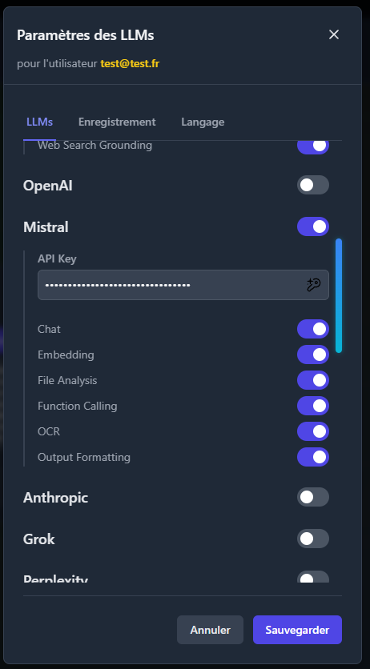

Supported providers: **Gemini, OpenAI, Anthropic, Mistral, Grok, Perplexity, Qwen, Kimi, DeepSeek**

Per-provider capability toggles: Chat · Embedding · File Analysis · Function Calling · OCR · Output Formatting · Web Search Grounding · Image Generation

### Local / on-premise models

Connect any local LLM server (LMStudio, Ollama-compatible) via a custom endpoint. The platform auto-detects available models and their capabilities:

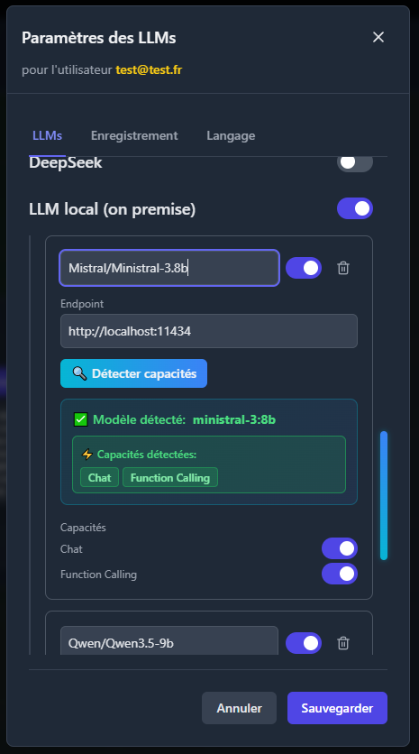

- Custom endpoint URL + port per model
- Automatic capability detection (Chat, Function Calling, Embedding...)
- Multiple local models supported simultaneously (e.g. Mistral-3.8b + Qwen3.5-9b)
- Privacy-first: local inference stays fully on-premise

### Save mode

Choose how the workflow saves changes — manual (Ctrl+S) or automatic after each action:

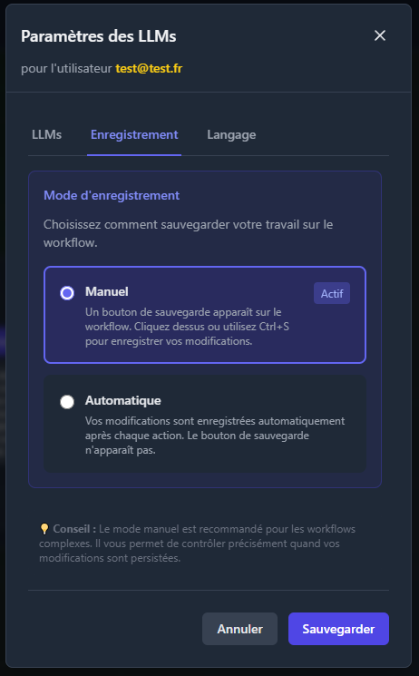

### Secure cloud storage profiles

Cloud media targets are configured once in **Settings → Cloud**, then reused by agents through profile references instead of raw secrets:

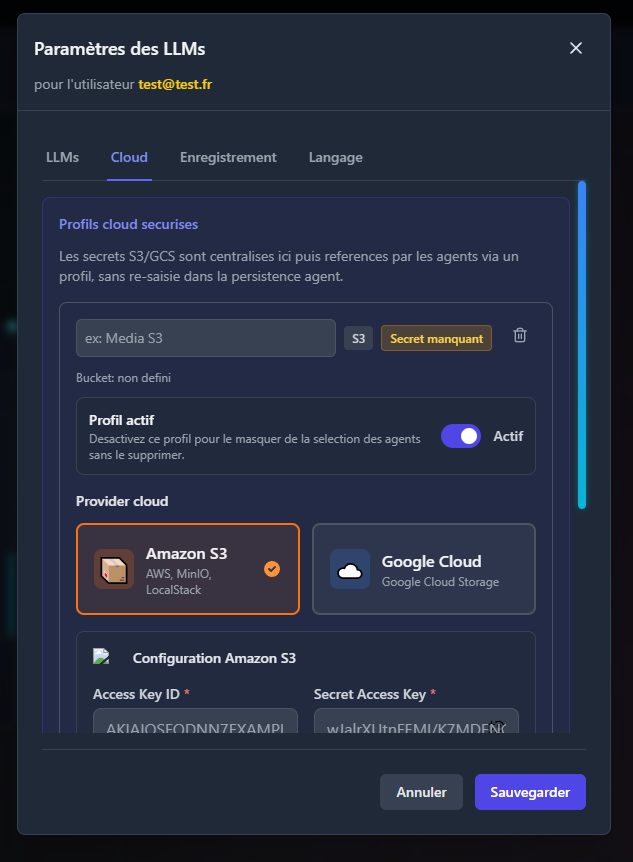

- Centralized **S3 and Google Cloud Storage** profiles
- Per-profile activation state to hide incomplete or maintenance profiles from agent selection
- Bucket, region / project, custom endpoint and key-prefix targeting
- Secret material managed in the settings surface, not duplicated inside agent persistence forms
- Designed to let agents reference cloud persistence safely through a profile identifier

---

## 3. Archi — AI agent prototyping

**Archi** is the first robot, responsible for designing and instantiating AI agents.

### Agent prototype library

Prototypes are reusable agent templates. Each prototype defines a role, a behavioral description, an LLM provider + model, and a set of capabilities:

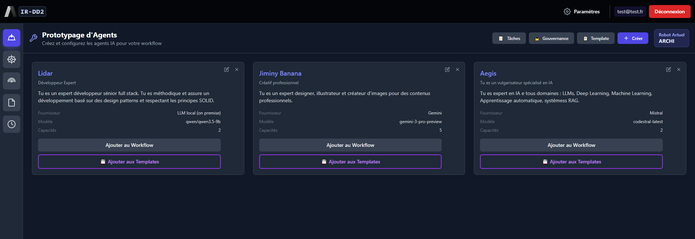

Prototypes can be added to the workflow canvas or saved as templates for reuse across projects.

### Create / edit a prototype

The prototype editor exposes all configuration options in one modal:

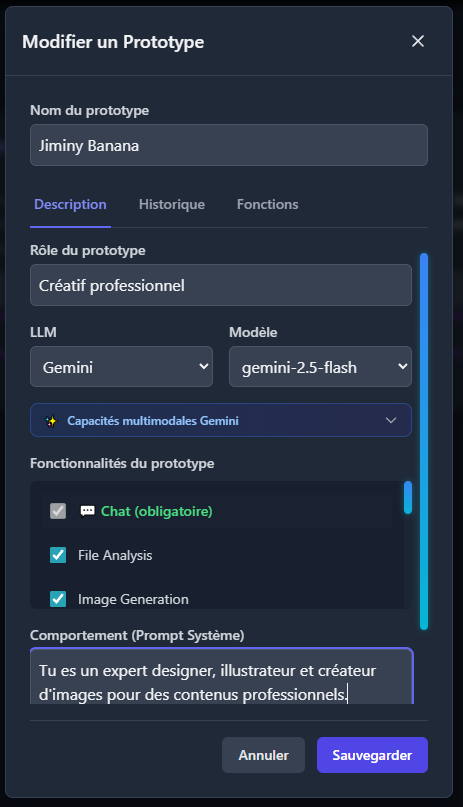

- **Role** — short label defining the agent's specialty
- **Behavioral prompt** — system prompt driving the agent's personality and constraints
- **LLM provider + model** — any configured cloud or local model
- **Multimodal capabilities** — per-provider toggles (e.g. Gemini multimodal, image generation)
- **Conversation history** — configurable long-term memory with auto-summarization thresholds
- **Functions** — attach custom or native functions to the agent

### Conversational memory (long-term history)

Each prototype can have its own memory configuration with fine-grained summarization triggers:

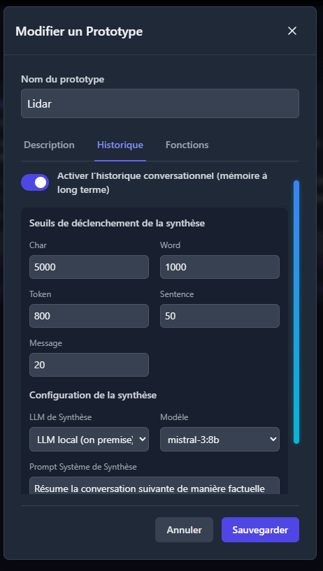

- Trigger thresholds: characters, words, tokens, sentences, message count
- Dedicated synthesis LLM (can differ from the agent's main model)
- Custom synthesis system prompt
- Works with both cloud and local models

### Function assignment

Assign capabilities to a prototype from the function library — native platform functions or custom user-created functions:

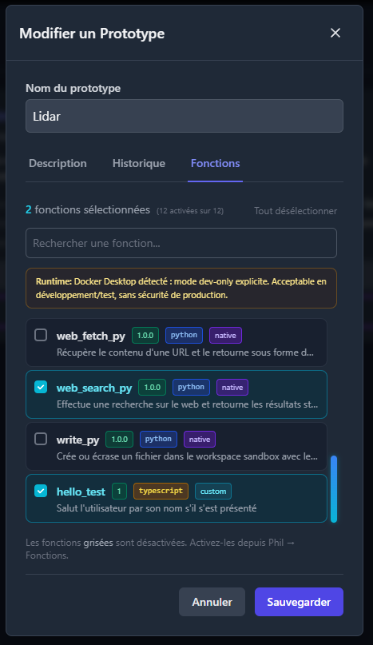

- Search and filter available functions
- Native functions (Python): `web_search_py`, `web_fetch_py`, `write_py`, `todo_write_py`...
- Custom functions (TypeScript or Python) created by the user in Phil's IDE
- Runtime compatibility warnings (Docker sandbox required for some functions)

### Content save configuration

When adding a prototype to the workflow, configure what gets persisted:

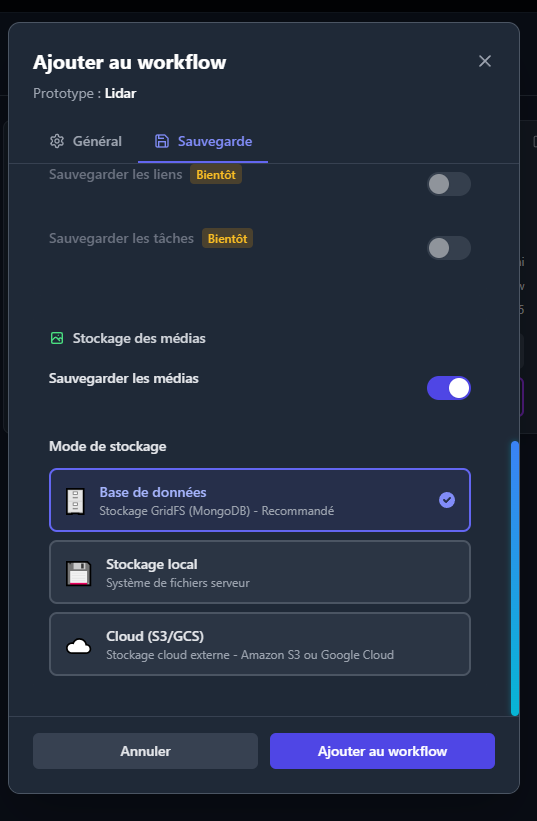

- Save conversation history
- Save generated media (images, documents, video) — MongoDB-backed journal storage, workspace filesystem, or cloud (S3/GCS)
- Per-agent granularity: each agent in the workflow has its own save policy

### Agent persistence policy

Each agent instance also exposes a dedicated **Persistence** tab to fine-tune what stays durable and where media should land:

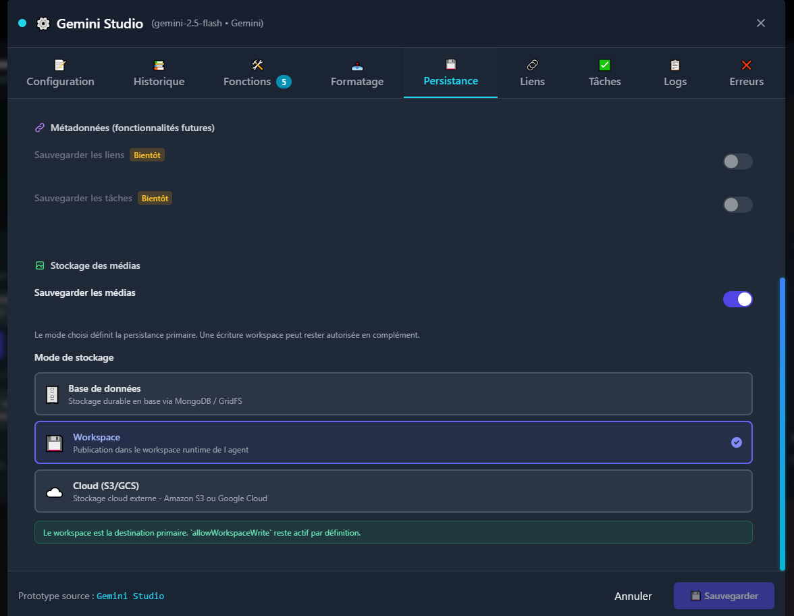

- Independent toggles for chat, errors, history summaries and media persistence
- Primary media destination per agent: **Database**, **Workspace**, or **Cloud (S3/GCS)**
- Optional companion workspace publication when the flow still needs runtime files alongside database or cloud persistence
- Secure cloud profile selection instead of re-entering provider secrets in the agent modal
- Future-facing placeholders for links and task persistence, already surfaced in the UI contract

---

## 4. Bos — supervision & workflow management

**Bos** is the supervision robot. Its menu gives access to the workflow map, live monitoring, analytics, user governance and workflow management.

### Multi-workflow management

Authenticated users can create and switch between multiple independent workflows:

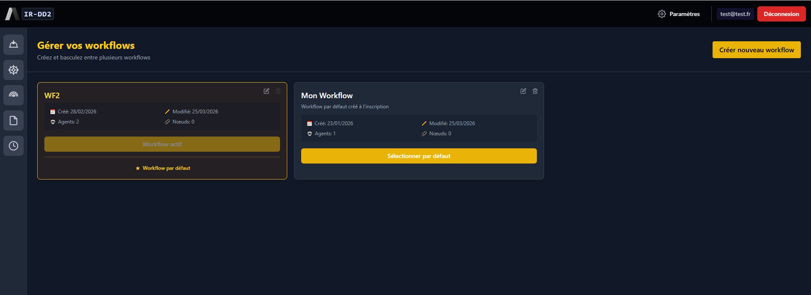

- Each workflow has its own agents, nodes, conversation history and connections
- Workflow metadata: creation date, last modified, agent count, node count
- Set a default workflow loaded on login

### Workflow media explorer

Bos also provides a workflow-scoped media explorer to inspect everything that has been persisted or cataloged across the current workflow:

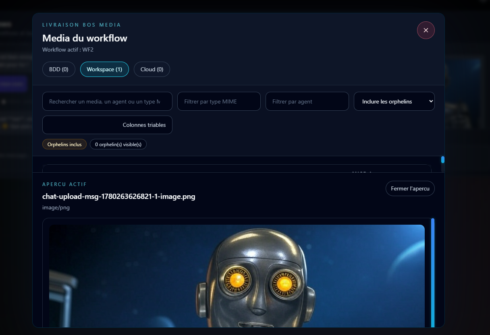

- Tabs by storage location: **BDD**, **Workspace**, **Cloud**
- Search and filtering by media name, MIME type, agent and orphan status
- Active preview area for supported files, starting with images and text-like content
- Counts per storage mode to understand where a workflow writes its outputs
- Useful to distinguish persisted chat media, imported files and sandbox-produced runtime artifacts

---

## 5. Com — API & database connectors

**Com** manages all external connections — HTTP APIs and databases — which can be turned into nodes on the workflow canvas.

### API node builder

Create, configure and test HTTP API connections:

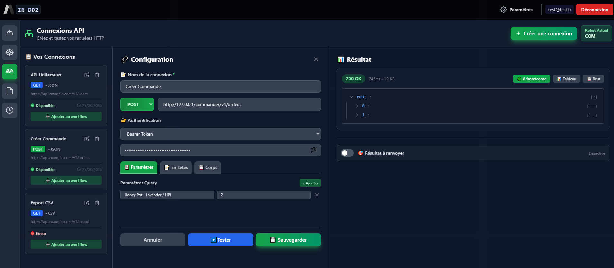

- Full HTTP method support (GET, POST, PUT, DELETE...)
- Authentication: Bearer Token, API Key, Basic Auth
- Query parameters, headers, request body configuration
- Live test with response viewer (tree / table / raw)
- Response format: JSON, CSV
- One-click "Add to workflow" — turns the connection into a canvas node

### Database connector

Connect to SQL, NoSQL and vector databases:

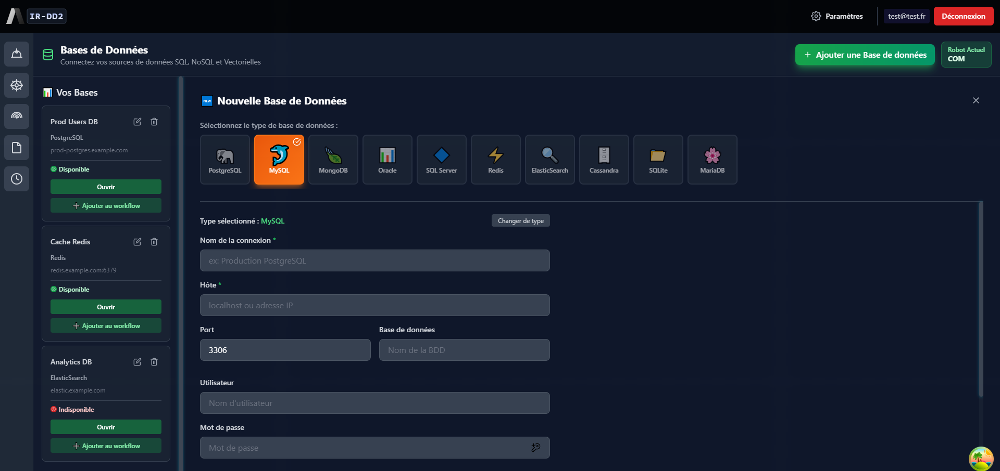

Supported engines: **PostgreSQL, MySQL, MongoDB, Oracle, SQL Server, Redis, ElasticSearch, Cassandra, SQLite, MariaDB**

### Built-in SQL explorer

Browse tables and run queries directly from the interface:

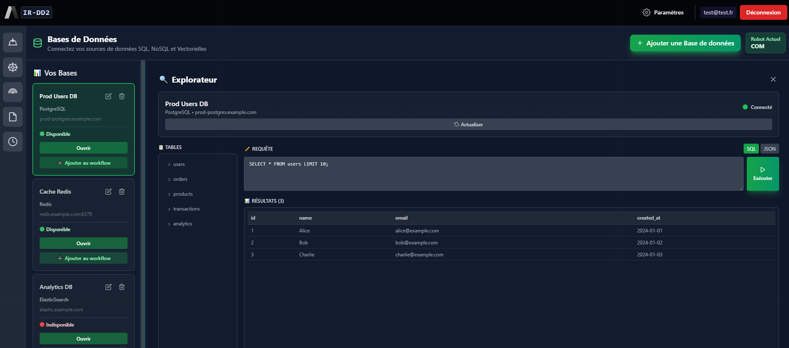

- Table browser with schema inspection
- SQL query editor with syntax highlighting
- Results displayed in a paginated table
- JSON output toggle
- Connection status indicator per database

---

## 6. Phil — custom function IDE

**Phil** manages the custom function library and provides an integrated IDE for writing, testing and publishing functions that agents can use as tools.

### Function library

Browse all available functions — native platform functions and user-created ones:

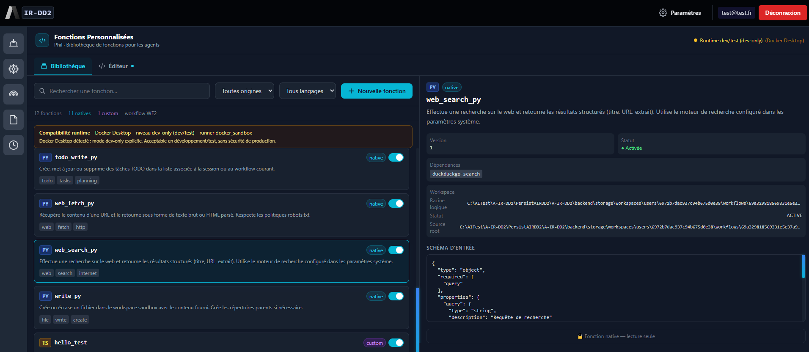

- Filter by origin (native / custom) and language (Python / TypeScript)
- Per-function detail panel: version, status, dependencies, workspace path, JSON input schema
- Enable / disable functions globally
- Native functions are read-only; custom functions are fully editable

### Function IDE

Write and test TypeScript or Python functions in an integrated editor with a live sandbox:

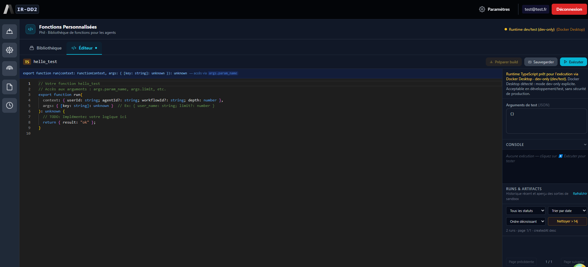

- Full syntax highlighting and TypeScript type annotations
- Function context: `userId`, `agentId`, `workflowId`, `depth`
- Test arguments panel (JSON input)
- Execution console with live output
- Run history with artifact inspection
- Ephemeral Docker sandbox for safe execution
- Build & save pipeline before attaching to prototypes

---

## 7. Workflow canvas — the main stage

The workflow canvas (accessible via Bos → Carte du workflow) is the central workspace where all agents and nodes live and interact.

### Multi-agent canvas

View and interact with all agents and nodes simultaneously on a pannable, zoomable canvas:

- Each agent appears as a chat node with its LLM provider and model
- Nodes (API, database, custom) are placed alongside agents
- Agents can be linked to nodes for tool use
- Mini-map for navigation on large workflows
- BOS context menu: quick access to monitoring, analytics, governance, workflow switcher

### Fullscreen agent view

Open any agent in fullscreen for focused interaction:

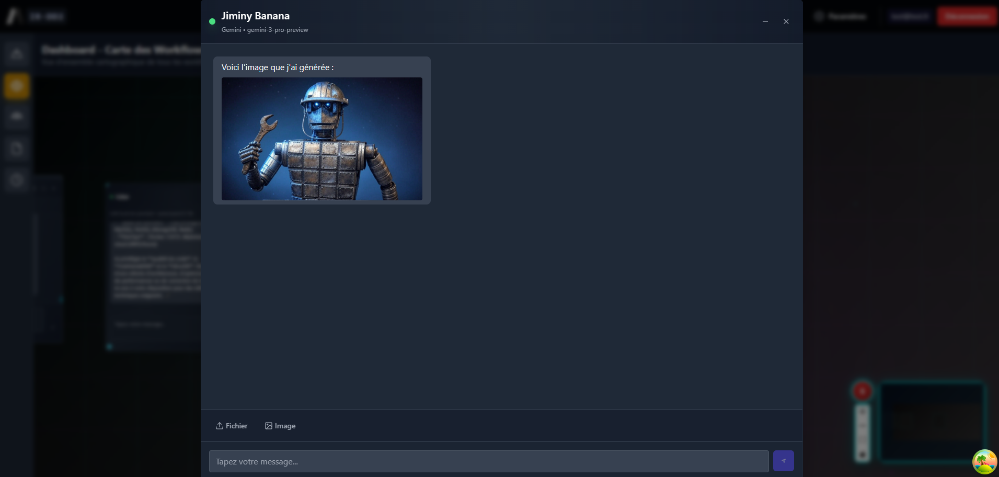

### Media panel — image generation

Agents with image generation capability display a dedicated media panel:

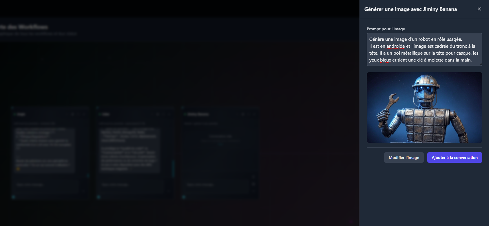

- Prompt input with live generation
- Generated image preview
- "Modify image" and "Add to conversation" actions
- Image injected directly into the agent's conversation context

---

## 8. Security model

| Layer | Implementation |
|-------|---------------|
| Authentication | JWT access tokens + refresh tokens |
| API key storage | AES-256-GCM encryption at rest (MongoDB `llm_configs`) |
| Session management | Keys in memory only — never persisted in localStorage (auth mode) |
| Code execution | Python & TypeScript functions run in ephemeral Docker sandbox (whitelisted tools) |
| Input validation | All API inputs sanitized server-side |
| CORS | Backend proxy for local LLM CORS handling |
| Dependency auditing | `npm audit` — run regularly |
| Transport | HTTPS recommended for production deployments |

---

*More features in progress — see [README.md](README.md) for the current release status.*
