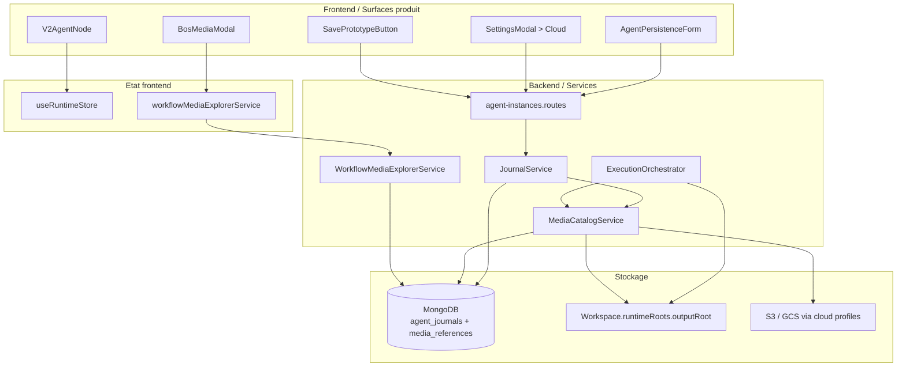

# Architecture Media et Persistance Workflow

**Date:** Juin 2026  
**Statut:** reference technique active  
**Public:** agents codeurs, architectes, QA technique

---

## 1. Objet

Cette documentation explique comment les medias sont configures, persistes, catalogues et explores dans A-IR-DD2.

Elle couvre trois familles de medias:

1. les medias conversationnels rattaches a un agent
2. les imports utilisateur ajoutes dans une conversation
3. les artefacts runtime produits par les sandboxes d'execution Python/TypeScript

Le but n'est pas de decrire une cible theorique. Le document decrit le comportement reel du projet et les frontieres a respecter lors des prochains changements.

---

## 2. Vue d'ensemble

### 2.1 Invariants principaux

1. La persistance est decidee au niveau agent/prototype via `PersistenceConfig`.
2. Le journal est la voie d'ecriture principale pour les contenus conversationnels et les imports media.
3. Le catalogue `MediaReference` est l'autorite de lecture workflow-scoped pour le BOS media explorer.
4. Le runtime outille les artefacts de sandbox via le workspace du workflow, pas via un stockage ad hoc hors workspace.
5. Les secrets cloud sont centralises dans Parametres > Cloud; les agents ne stockent qu'une reference de profil.

### 2.2 Schema d'architecture

---

## 3. Contrats de donnees

### 3.1 PersistenceConfig

Source principale: `backend/src/types/persistence.ts`

Champs a retenir:

- `saveChat`: persistance des messages conversationnels
- `saveErrors`: persistance des erreurs
- `saveHistorySummary`: persistance des syntheses d'historique
- `saveMedia`: activation de la persistance media
- `mediaStorage`: mode primaire produit `db | workspace | cloud`
- `allowWorkspaceWrite`: autorise aussi une publication workspace quand le flux en a besoin
- `cloudConnectionProfileId`: reference vers un profil cloud securise

Regle cle:

- `mediaStorage = workspace` force `allowWorkspaceWrite = true`
- `mediaStorage = db` ou `cloud` peut tout de meme garder `allowWorkspaceWrite = true` comme publication complementaire

### 3.2 Modes de stockage

| Mode produit UI | Normalisation backend | Support physique principal | Usage typique |
|-----------------|-----------------------|----------------------------|---------------|
| `db` | `db` cote produit, alias historique `database` cote persistence | entree `media` dans `agent_journals` + catalogue `media_references` | media conversationnel ou import persiste dans MongoDB |
| `workspace` | `workspace` cote produit, alias historique `local` cote persistence | `Workspace.runtimeRoots.outputRoot` | artefacts runtime, fichiers accessibles dans le workspace du workflow |
| `cloud` | `cloud` | bucket S3/GCS reference par profil | media externalise, gouverne par profil cloud |

Important:

- le libelle produit peut parler de "base de donnees" ou de "workspace", mais la normalisation backend convertit encore certains alias historiques (`database`, `local`) vers les valeurs produit canoniques.

### 3.3 Journal media

Les medias conversationnels et imports passent par `MediaJournalPayload`.

Le journal stocke notamment:

- `mimeType`
- `fileName`
- `size`
- `storageMode`
- soit `data` (mode base), soit `path` (mode workspace), soit `url` (mode cloud)
- `checksum`, `metadata`, informations de correlation eventuelles

### 3.4 Catalogue MediaReference

`MediaReference` porte le read model workflow-scoped utilise par BOS et les APIs media.

Champs structurants:

- `primaryStorageMode`
- `canonicalLocator`
- `journalEntryId` si la source vient du journal
- `cloudConnectionProfileId` si la source cloud est resolue par profil
- provenance (`user`, `agent`, `function`, `import`, `runtime_output`)
- informations createur / dernier modificateur / orphelin

Le catalogue permet d'unifier:

1. la lecture BOS
2. le preview et le download
3. la suppression physique selon le mode
4. la gestion des orphelins quand un agent disparait

---

## 4. Flux fonctionnels reels

### 4.1 Configuration de persistance agent

Surface principale:

- `components/modals/AgentPersistenceForm.tsx`

Flux:

1. l'utilisateur active `saveMedia`
2. il choisit un stockage primaire `db`, `workspace` ou `cloud`
3. si le mode cloud est choisi, l'agent selectionne un `cloudConnectionProfileId`
4. le frontend normalise la config avant ecriture
5. les routes prototype/instance repassent la config par les helpers de normalisation backend

Routes/backend associes:

- `backend/src/routes/agent-prototypes.routes.ts`
- `backend/src/routes/agent-instances.routes.ts`
- `backend/src/types/persistence.ts`

### 4.2 Profils cloud securises

Surface principale:

- `components/modals/SettingsModal.tsx`

Principe:

1. les secrets S3/GCS sont saisis et testes dans Parametres > Cloud
2. le profil porte un `displayName`, un provider (`s3` ou `gcs`), une cible (`bucket`, region/project, endpoint, prefixe)
3. les agents ne ressaisissent pas ces secrets; ils ne conservent qu'un identifiant de profil

Consequence architecturale:

- toute nouvelle surface agent/media doit continuer a referencer un profil cloud plutot qu'un payload secret inline

### 4.3 Imports media utilisateur depuis un agent

Front:

- `components/V2AgentNode.tsx`
- `stores/useRuntimeStore.ts`
- `components/SavePrototypeButton.tsx`

Flux reel:

1. un fichier importe devient un `PendingNodeAttachment` runtime avec `origin: 'llm_file_upload'`
2. tant que le draft n'est pas persiste, `draftPersisted = false`
3. le save workflow manuel appelle `POST /api/workflows/:workflowId/instances/:agentInstanceId/imported-media`
4. la route transforme le base64 en buffer et appelle `journalService.logMedia()`
5. l'ecriture journal cree ou met a jour le catalogue `MediaReference`

Point d'attention:

- l'import runtime n'est pas automatiquement un fichier workspace. Il suit d'abord le chemin journal/catalogue.

### 4.4 Medias conversationnels et contenus inline

Route legacy d'appoint:

- `POST /api/agent-instances/:id/content`

Route canonique de journal:

- `POST /api/agent-instances/:agentInstanceId/journal`

Principe:

1. les messages, erreurs et medias sont convertis en entrees journal
2. `JournalService` applique la `persistenceConfig`
3. si le type est `media`, le write path peut alimenter le catalogue media

Il faut raisonner en "journal d'abord", meme quand la surface produit parle surtout de stockage media.

### 4.5 Artefacts runtime issus des sandboxes

Services principaux:

- `backend/src/services/sandbox.service.ts`
- `backend/src/services/runtime/ExecutionOrchestrator.ts`

Flux:

1. un tool Python/TypeScript s'execute dans le runner prefere
2. le runner par defaut reste `docker_sandbox`
3. les artefacts produits sous `output/` sont collectes par l'orchestrateur
4. `MediaCatalogService.registerRuntimeOutputArtifacts()` projette ces artefacts dans `MediaReference`

Resultat:

- les sorties de sandbox apparaissent dans la meme lecture BOS que les medias conversationnels, tout en gardant une provenance `runtime_output`

### 4.6 Lecture BOS media explorer

Front:

- `components/modals/BosMediaModal.tsx`
- `services/workflowMediaExplorerService.ts`

Back:

- `backend/src/services/workflowMediaExplorer.service.ts`

Capacites actuelles:

1. onglets `BDD`, `Workspace`, `Cloud`
2. filtres texte, MIME, agent, orphelins
3. tri par date, nom, taille
4. preview de medias compatibles
5. comptage par mode de stockage

Le BOS explorer consomme le catalogue, pas le journal brut, ce qui permet une lecture unifiee quel que soit le stockage physique.

### 4.7 Suppression d'agent et gestion des orphelins

Lorsqu'une instance d'agent est supprimee, la politique de suppression media doit distinguer:

1. suppression physique du media
2. conservation comme media orphelin encore visible au niveau workflow

La documentation media doit donc toujours traiter la vie d'un media au-dela de la vie de l'agent createur.

---

## 5. Relation avec Docker et le workspace

### 5.1 Conteneurisation

Le `docker-compose` du repo demarre aujourd'hui la base MongoDB. Le runtime d'execution outille, lui, s'appuie sur des runners dedies cote backend.

### 5.2 Sandbox runner prefere

Le runner courant pour l'execution outillee est `docker_sandbox`.

Le prototype Firecracker existe encore comme trajectoire optionnelle, mais la documentation produit et technique doit continuer a considerer Docker comme chemin nominal pour l'execution d'outils.

### 5.3 Lien avec les medias

Ce point est important pour eviter les confusions:

1. Docker sandbox execute le code des tools
2. les artefacts de sortie sont collectes sous le workspace du workflow
3. ces artefacts sont ensuite catalogues comme medias workflow
4. le BOS explorer les lit comme une source de media parmi d'autres

Autrement dit, le sandbox runtime et l'architecture media se rejoignent au niveau du workspace `outputRoot` et du catalogue `MediaReference`.

---

## 6. Points d'entree code prioritaires

| Zone | Fichier | Raison |
|------|---------|--------|
| Contrat de persistance | `backend/src/types/persistence.ts` | source de verite des modes media et de la normalisation |
| Formulaire agent | `components/modals/AgentPersistenceForm.tsx` | surface de configuration par agent |
| Profils cloud | `components/modals/SettingsModal.tsx` | gestion des profils S3/GCS et separation des secrets |
| Import utilisateur | `components/SavePrototypeButton.tsx` | persistance des drafts media runtime |
| Route d'import | `backend/src/routes/agent-instances.routes.ts` | ecriture journal pour imports media |
| Projection catalogue | `backend/src/services/mediaCatalog.service.ts` | creation/reparation des references media |
| Catalogue repository | `backend/src/repositories/MediaReferenceRepository.ts` | upsert et derivees `canonicalLocator` / `primaryStorageMode` |
| Lecture BOS | `backend/src/services/workflowMediaExplorer.service.ts` | listing workflow-scoped et filtres |
| UI BOS | `components/modals/BosMediaModal.tsx` | tabs `BDD / Workspace / Cloud`, preview, tri |
| Artefacts runtime | `backend/src/services/runtime/ExecutionOrchestrator.ts` | collecte et catalogage des sorties de sandbox |

---

## 7. Limites et regles a ne pas oublier

1. Ne pas documenter `cloud` comme un simple champ inline dans l'agent: le pattern voulu est bien profil securise + reference.
2. Ne pas confondre `db` avec un depot documentaire autonome: la voie actuelle reste journal-backed pour les medias conversationnels.
3. Ne pas supposer que tous les medias viennent d'un chat: les artefacts runtime suivent un chemin workspace -> catalogue.
4. Ne pas oublier `allowWorkspaceWrite` quand un flux doit conserver une copie exploitable dans le workspace meme si le stockage primaire est `db` ou `cloud`.
5. Ne pas reutiliser le BOS explorer comme mecanisme d'auto-reparation nominale si une ecriture journal/catalogue peut prendre cette responsabilite plus tot.
6. Lors d'un futur refactor, traiter separement la configuration agent, les imports utilisateur, les artefacts runtime, la lecture BOS et la suppression/orphelinage.

---

## 8. Resume ultra-court pour agent codeur

Si un agent codeur doit repartir vite:

1. commencer par `backend/src/types/persistence.ts`
2. verifier la surface UI dans `components/modals/AgentPersistenceForm.tsx`
3. suivre le write path `journal.service.ts` puis `mediaCatalog.service.ts`
4. regarder `ExecutionOrchestrator.ts` si le sujet touche aux artefacts de sandbox
5. regarder `BosMediaModal.tsx` + `workflowMediaExplorer.service.ts` si le sujet touche a l'exploration workflow
