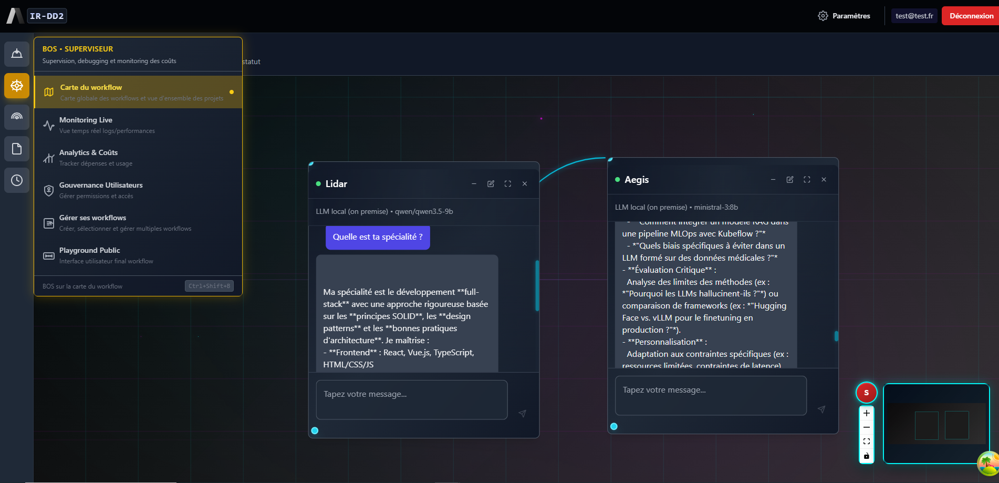

# A-IR-DD2 — AI Robot Design & Development System V2

[](https://opensource.org/licenses/MIT)
[](https://www.typescriptlang.org/)
[](https://reactjs.org/)
[](https://nodejs.org/)
[](https://www.mongodb.com/)
[](https://www.python.org/)
🇫🇷 [Voir la description en français](#-à-propos)

---

> **A visual multi-agent orchestration platform — design, configure and run specialized AI agents on an interactive workflow canvas.**

A-IR-DD2 lets you build complex AI workflows through a **visual node-based editor**, powered by **9 cloud LLM providers + local on-premise models**. Agents are built from reusable prototypes, each with their own role, memory, custom functions, API connections and database nodes — all managed by a team of 5 specialized Robots.



---

## ✨ Key highlights

- 🤖 **5 specialized Robots** — each managing a dedicated domain (agents, monitoring, connections, functions, events)
- 🧩 **Visual workflow canvas** — drag, connect and chat with multiple AI agents simultaneously
- ⚡ **9 cloud LLM providers** + local on-premise models (LMStudio, Ollama-compatible)
- 🔧 **Custom function IDE** — write, test and attach Python/TypeScript functions to agents in a sandboxed environment
- 🗄️ **Multi-database connector** — PostgreSQL, MySQL, MongoDB, Redis, ElasticSearch, Oracle and more
- 🔗 **API node builder** — configure and test HTTP connections, inject them into workflows
- 🔐 **Enterprise security** — JWT auth, AES-256-GCM encrypted API keys, per-user persistence
- 🌍 **8 languages** supported (i18n)

👉 **[Explore all features →](FEATURES.md)**

---

## 🏗️ Architecture overview

```
┌─────────────────┐         ┌──────────────────┐         ┌─────────────────┐
│   Frontend      │         │   Backend Proxy  │         │  Local Models   │
│  React 18 + TS  │◄───────►│  Node.js + TS    │◄───────►│exLMStudio/Ollama│
│  React Flow     │         │  Express + JWT   │         └─────────────────┘
└─────────────────┘         └──────────────────┘
                                    │
                              JWT + AES-256-GCM
                                    │
                             ┌──────┴───────┐
                             │   MongoDB    │         ┌──────────────────┐
                             │ users/keys/  │         │  Cloud LLMs      │
                             │ workflows    │         │  Gemini · GPT-4  │
                             └─────────────┘         │  Mistral · Grok  │
                                                      │  Anthropic · ... │
                                                      └──────────────────┘
```

**Stack:** React 18 · TypeScript · Tailwind · Zustand · React Flow · Node.js · Express · MongoDB · Python · Docker

---

## 🚀 Quick start

> **Prerequisites:** Node.js 24.15.x, MongoDB 6+ (or Docker), Python 3.11+

```bash
# 1. Clone
git clone https://github.com/sylvainbonnecarrere/A-IR-DD2.git
cd A-IR-DD2

# Runtime pin
# .nvmrc and .node-version target Node 24.15.0

# 2. Install dependencies
npm install
cd backend && npm install && cd ..

# 3. Generate security keys & configure backend
cp backend/docker/.env.docker backend/.env
node -e "console.log('JWT_SECRET=' + require('crypto').randomBytes(32).toString('hex'))"
node -e "console.log('ENCRYPTION_KEY=' + require('crypto').randomBytes(32).toString('hex'))"
# → update backend/.env with:
#    - MONGO_USER
#    - MONGO_PASSWORD
#    - MONGODB_URI using the same MongoDB credentials
#    - JWT_SECRET
#    - ENCRYPTION_KEY

# 4. Start with Docker (recommended)
cd backend/docker && docker-compose --env-file ../.env up -d && cd ../..

# 5. Start services
# Terminal 1 — backend:  cd backend && npm run dev
# Terminal 2 — frontend: npm run dev

# 6. Open http://localhost:4000
# Test account: test@example.com / TestPassword123
```

For detailed installation, environment variables and troubleshooting → [INSTALLATION_GUIDE.md](INSTALLATION_GUIDE.md)

---

## 🤖 The 5 Robots

| Robot | Domain | Responsibilities |
|-------|--------|-----------------|
| **Archi** | Agent design | Create & configure AI agent prototypes, manage tasks and links |
| **Bos** | Supervision | Workflow map, live monitoring, analytics & costs, user governance |
| **Com** | Connections | API nodes, database connectors, MCP integrations |
| **Phil** | Functions & data | Custom function IDE, function library, RAG, file handling |
| **Tim** | Events | Triggers, webhooks, scheduling, async task management |

---

## 🔐 Security model

| Layer | Mechanism |
|-------|-----------|
| Authentication | JWT access + refresh tokens |
| API key storage | AES-256-GCM encryption at rest (MongoDB) |
| Session | Keys in memory only — never in localStorage (authenticated mode) |
| Code execution | Python/TS functions run in ephemeral Docker sandbox |
| Transport | HTTPS recommended for production |

---

## 📄 License

MIT — see [LICENSE](LICENSE) for details.

---

## 🇫🇷 À propos

A-IR-DD2 est une plateforme d'orchestration multi-agents IA à interface visuelle. Elle permet de concevoir des workflows d'agents IA spécialisés sur une carte interactive, de les connecter à des LLMs cloud ou locaux, de leur attribuer des fonctions personnalisées en Python ou TypeScript, des connexions API, des bases de données, et de gérer leur mémoire conversationnelle.

Projet solo développé par **Sylvain Bonnecarrère** — développeur senior fullstack & SecOps, spécialisé IA générative.

👉 **[Toutes les fonctionnalités en détail →](FEATURES.md)**

---

*Last updated: J4.3 — March 2026*

Les suites Jest de validation pré-push sont maintenues avec un taux de réussite de 100% sur les correctifs stabilisés, et les commandes standard à exécuter sont `npm test`, `npm run test:coverage`, `cd backend && npm test` et `cd backend && npm run test:coverage`.
Le rapport ciblé SettingsModal est généré via `npm run test:settingsmodal:report`, avec sortie versionnée dans `tests/temp_rapport_tests/unitaires/settingsmodal/`.
